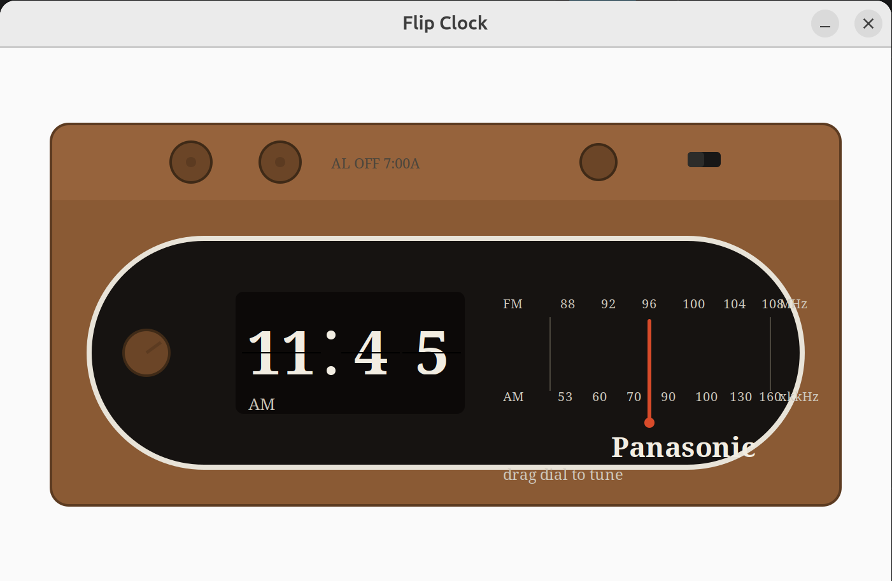

# Flip Clock

A desktop flip-clock app in C, modeled after a Panasonic mechanical
flip-clock radio. Built with GTK4 and GStreamer.



## Features

- **Mechanical flip animation** — hour, tens-of-minutes, and
  ones-of-minutes digits each flip independently, simulating the
  physical leaf-flip motion of a real split-flap display.
- **Functional FM/AM tuner** — drag the needle across the dial to tune
  to one of three preset internet radio stations (streamed live via
  GStreamer). Automatically reconnects on stream drop.
- **Full alarm clock** — set an alarm time, snooze, dismiss, with a
  buzzer tone independent of the radio (works even with no network).
- **Volume control** — a real rotary knob, drag up/down.
- **Fixed-size window** matching the proportions of the physical
  device, non-resizable.

## Building

Dependencies: GTK4, GStreamer 1.0 (+ audio), Check (for unit tests),
Meson, Ninja.

On Debian/Ubuntu:

```sh
sudo apt-get install meson ninja-build libgtk-4-dev \
  libgstreamer1.0-dev libgstreamer-plugins-base1.0-dev \
  gstreamer1.0-plugins-good gstreamer1.0-plugins-bad check
```

Then:

```sh
meson setup builddir
ninja -C builddir
```

## Running

```sh
./builddir/flipclock
```

## Testing

```sh
meson test -C builddir --verbose
```

38 unit tests across 4 suites, covering the clock/date logic, the
flip-animation state machine, the radio's preset-snapping and
retry logic, and the alarm's scheduling (including daily recurrence
and midnight/snooze wraparound edge cases). All are pure-logic tests
with no GTK, GStreamer, or network dependency, so they run fast and
deterministically.

## Architecture

```
src/
├── main.c          Entry point: GTK application setup, gst_init()
├── clock_model.c/h Time/date logic: 24h -> 12h conversion, formatting
├── clock_view.c/h  All GTK/Cairo rendering + input handling (the
│                   biggest file -- owns the per-window state struct
│                   and every drawing/gesture callback)
├── flip_anim.c/h   Pure state machine for one flipping digit's
│                   animation progress (used x3, one per digit)
├── radio.c/h       GStreamer playbin wrapper: preset stations,
│                   nearest-preset lookup, tune/volume/reconnect
├── alarm.c/h       Pure state machine for the alarm (set time,
│                   enable, ring, snooze, dismiss)
└── buzzer.c/h      Separate GStreamer pipeline for the alarm tone
                    (audiotestsrc, no network dependency)

tests/
├── test_clock_model.c
├── test_flip_anim.c
├── test_radio.c
└── test_alarm.c
```

**Design principle throughout:** every module that has meaningful
logic (time conversion, animation progress, preset selection, retry
capping, alarm scheduling) is written as pure functions with no GTK
or GStreamer dependency, so it can be unit-tested in isolation. GTK
and GStreamer calls live only in `main.c`, `clock_view.c`, `radio.c`,
and `buzzer.c`, which are exercised by manual/behavioral testing
instead (see commit history for details on what was verified how).

## Known limitations

- The flip animation's leaf-fold is a 2D approximation (vertical scale
  toward the hinge line), not true 3D perspective — Cairo doesn't
  support that natively. This is the standard technique most software
  flip-clocks use.
- The three radio presets point to specific SomaFM stations; if a
  stream URL changes server-side, update `radio_presets` in
  `src/radio.c` (SomaFM publishes current direct-server URLs at
  `somafm.com/<channel>/directstreamlinks.html`).
- Only 5 physical controls exist on the case (2 alarm knobs, snooze
  knob, on/off switch, volume knob), so a brightness control was
  dropped in favor of the full alarm feature. Adding a 6th control
  would need a small layout change in `clock_view.c`.
